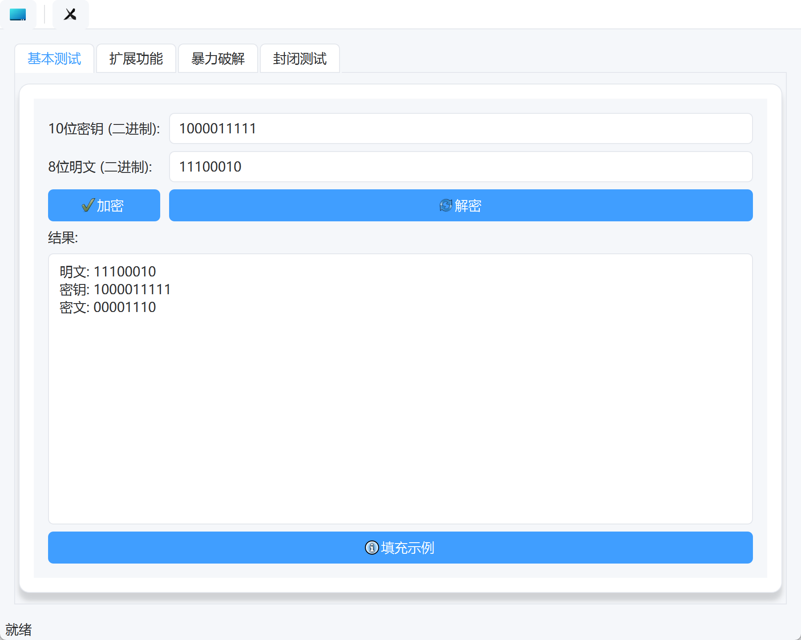
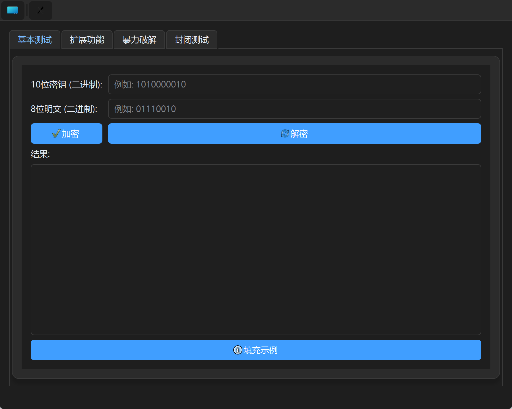
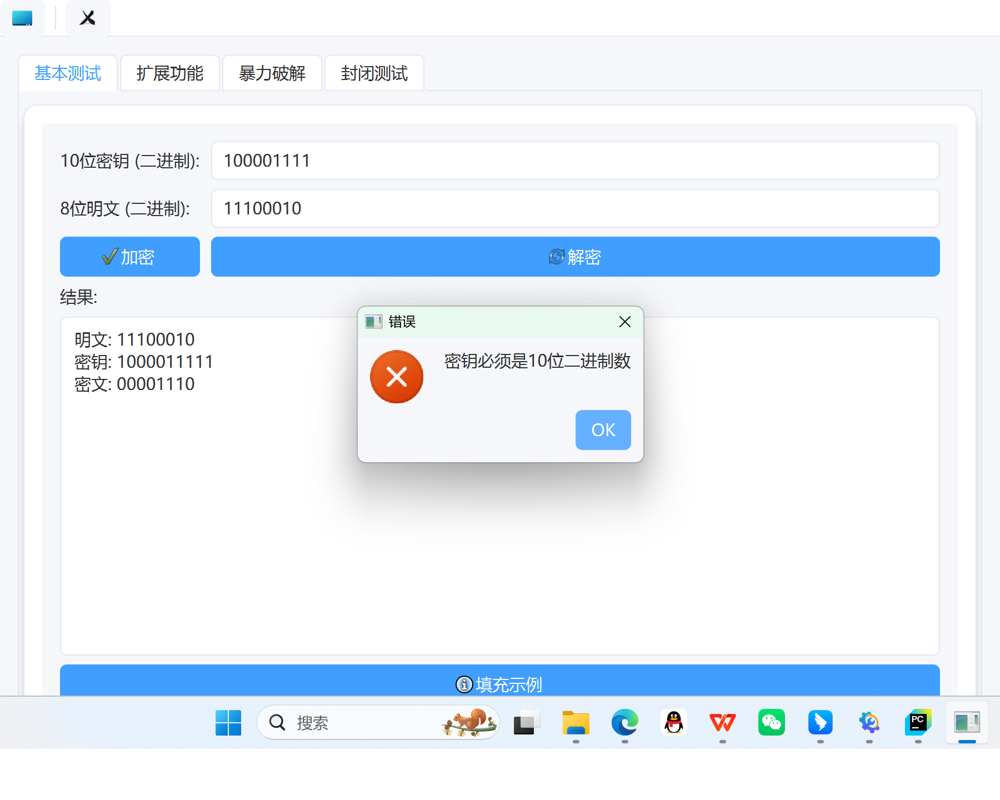
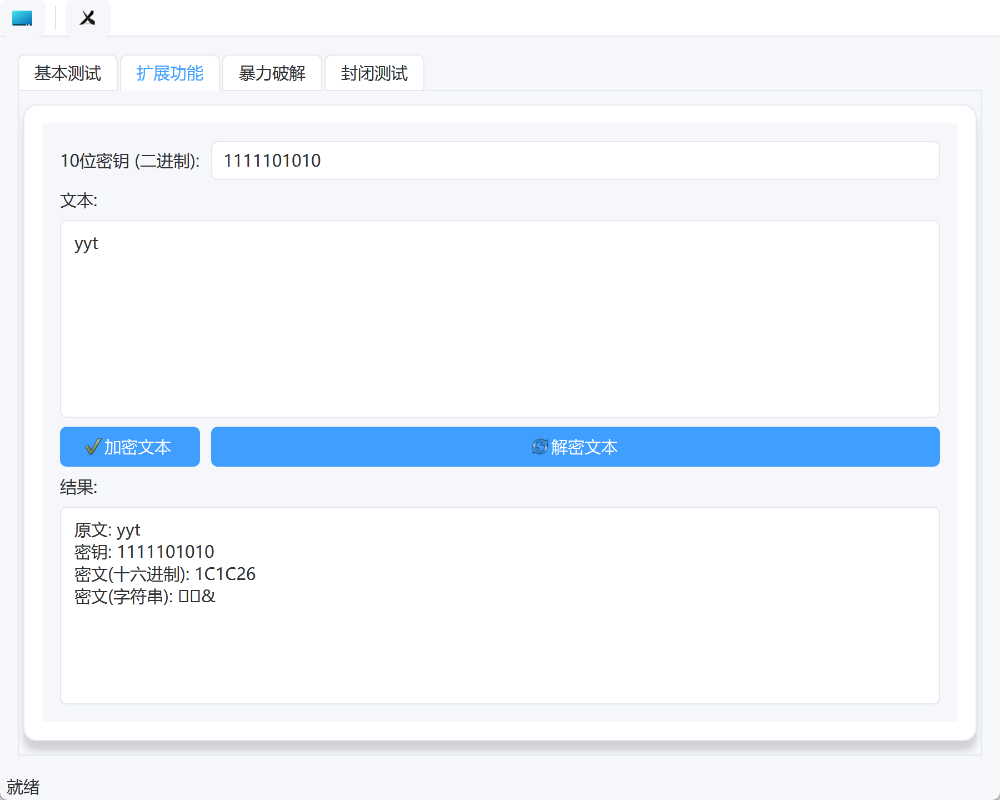
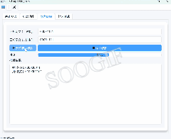
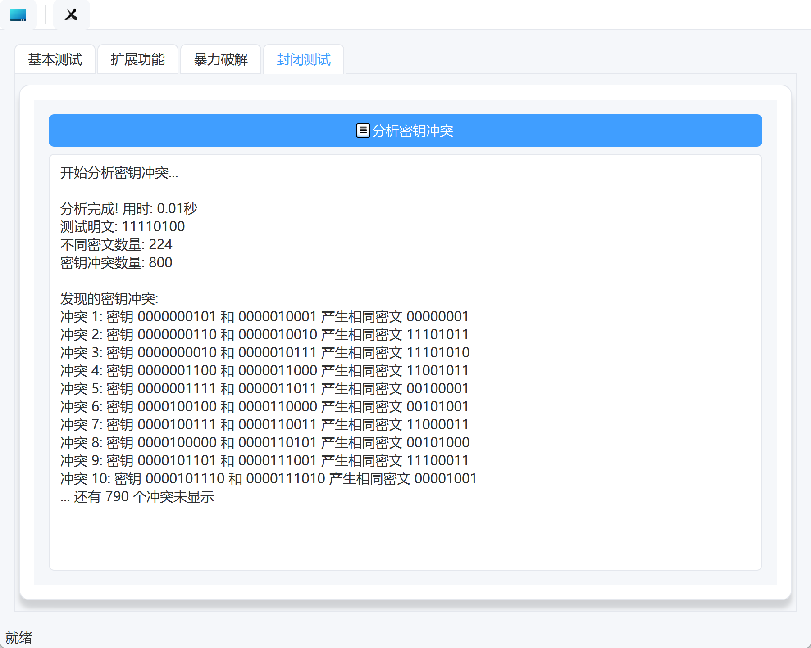

# S-DES 
重庆大学大数据与软件学院信息安全导论作业1：S-DES算法实现

### 1. 算法实现

> 我们的S-DES算法实现在`des.py`文件中，其中可以使用到S-DES算法的加密和解密两个函数。 

为了实现良好的 S-DES 算法实现类，采用了面向对象的设计思想。

- 初始化函数为：`def __init__(self, key, P10, P8, IP, IP_INV, EP, S0, S1, P4):`
  - 其中`key`为10位二进制字符串，`P10`、`P8`、`IP`、`IP_INV`、`EP`、`S0`、`S1`、`P4`为置换表，如果不传入，则使用默认的置换表。
  - 我们设计中将作业要求中的置换表作为默认置换表，因此在实验使用时，可以不传入置换表。
- 定义了：`permute(bits, permutation):`函数，用于实现置换操作。
- 定义了：`left_shift(bits, n):`函数，用于实现循环左移操作，可以选择移动位数。
- 定义了：`generate_keys(self, key):`函数，用于生成子密钥。
- 定义了：`f_function(self, right, key):`函数，轮函数f，负责进行扩展、置换、S盒转换等操作。
- 以及加密函数：`encrypt_block(self, plaintext, key):`和解密函数：`decrypt_block(self, ciphertext, key):`。 


### 2. GUI设计
> - 我们为了设计一个交互良好的界面，使用了` Tkinter 和 PyQt`框架进行GUI设计。
> - 我们的GUI设计中，主要分为四个页面，分别是`基本测试`、`扩展功能`、`暴力破解`、`封闭测试`。





上述的图片简单展示了我们的界面设计，可以看到我们的界面设计十分简洁，同时也有良好的交互性。
### 3. 安装与运行

#### 3.1 环境要求
Python 3.6+

#### 3.2 安装依赖

```shell
pip install PyQt4
```

#### 3.3 运行项目

- 使用 Tkinter 界面（推荐用于简单部署）
```shell
python python gui/des_tk.py
```

- 使用 PyQt 界面（推荐用于更好的用户体验）
```shell
python python gui/qt/des_tk.py
```

### 4. 编程和测试要求

#### 4.1 第1关：基本测试

根据S-DES算法编写和调试程序，提供GUI解密支持用户交互。输入可以是8bit的数据和10bit的密钥，输出是8bit的密文。

输入可以是8bit的数据和10bit的密钥，输出是8bit的密文：


当输入不符合标准时，返回处理失败的错误：




#### 4.2 第2关：交叉测试

> 考虑到是**算法标准**，所有人在编写程序的时候需要使用相同算法流程和转换单元(P-Box、S-Box等)，以保证算法和程序在异构的系统或平台上都可以正常运行。设有A和B两组位同学(选择相同的密钥K)；则A、B组同学编写的程序对明文P进行加密得到相同的密文C；或者B组同学接收到A组程序加密的密文C，使用B组程序进行解密可得到与A相同的P。
> - 具体详细测试代码请看[task2测试文件](https://github.com/y-yyyt/S-DES/tree/main/task2.ipynb)。

#### 4.3 第3关：扩展功能

考虑到向实用性扩展，加密算法的数据输入可以是ASII编码字符串(分组为1 Byte)，对应地输出也可以是ACII字符串(很可能是乱码)。

##### 4.3.1 GUI界面中测试

处理ASCII输入：



##### 4.3.2 ASCII码加密时的处理

因为我们常用的字符集仅仅只是0-127位的ASCII码，所以我们在加密时对应的只剩下了7位bit，这并不符合SDES算法的加密要求，我们综合考虑多种方式之后选择了更为全面的Unicode字符集，选取前256作为我们的字符集。

同时ASCII字符在加密后往往会出现乱码或者无法显示的控制符（但是不影响解密，只要正确复制后即可正常解密）。
所以我们在加密ASCII码是采用了显示十六进制的加密结果，而不是对应的Unicode字符，避免了很多无法显示的结果与乱码。
在对应的解密阶段我们也采用了十六进制的解密方式，将十六进制的密文转换为对应的ASCII码，这样就可以避免乱码的出现。

#### 4.4 第4关：暴力破解

假设你找到了使用相同密钥的明、密文对(一个或多个)，请尝试使用暴力破解的方法找到正确的密钥Key。在编写程序时，你也可以考虑使用多线程的方式提升破解的效率。请设定时间戳，用视频或动图展示你在多长时间内完成了暴力破解。


#### 4.5 第5关：封闭测试

根据第4关的结果，进一步分析，对于你随机选择的一个明密文对，是不是有不止一个密钥Key？进一步扩展，对应明文空间任意给定的明文分组P_{n}，是否会出现选择不同的密钥K_{i}\ne K_{j}加密得到相同密文C_n的情况？



---
**至此，我们完成了全部S-DES加密算法的实现、GUI界面的设计，以及要求中提到的五个任务。较好的完成了本次实验。**
